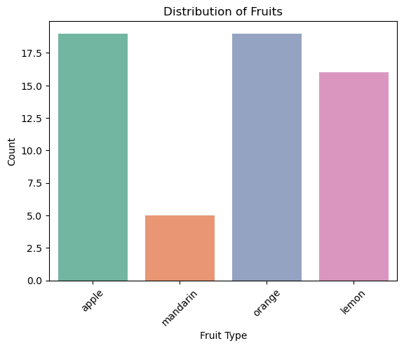
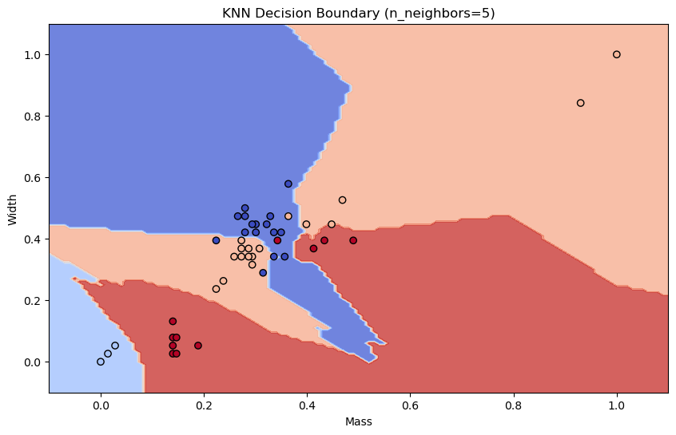

### Step 1: Importing Necessary Libraries

Import libraries for data manipulation, visualization, and machine learning algorithms.


```python

import pandas as pd
import numpy as np
import seaborn as sns
import matplotlib.pyplot as plt
from sklearn.model_selection import train_test_split
from sklearn.preprocessing import MinMaxScaler
from sklearn.linear_model import LogisticRegression
from sklearn.tree import DecisionTreeClassifier
from sklearn.neighbors import KNeighborsClassifier
from sklearn.naive_bayes import GaussianNB
from sklearn.svm import SVC
from sklearn.metrics import accuracy_score

```

### Step 2: Loading and Exploring the Dataset

Load the fruit dataset, display its structure, and explore key statistics.


```python

# Load the dataset
fruits = pd.read_table('2.fruit_data_with_colors.txt')

# Display the first few rows
print("Dataset Head:")
print(fruits.head())

# Unique fruit names
print("\nUnique Fruits:")
print(fruits['fruit_name'].unique())

# Dataset shape and description
print("\nDataset Shape:", fruits.shape)
print("\nDataset Statistics:")
print(fruits.describe())

# Visualize fruit type distribution
sns.countplot(x='fruit_name', data=fruits, palette='Set2')
plt.title('Distribution of Fruits')
plt.xlabel('Fruit Type')
plt.ylabel('Count')
plt.xticks(rotation=45)
plt.show()

```

    Dataset Head:
       fruit_label fruit_name fruit_subtype  mass  width  height  color_score
    0            1      apple  granny_smith   192    8.4     7.3         0.55
    1            1      apple  granny_smith   180    8.0     6.8         0.59
    2            1      apple  granny_smith   176    7.4     7.2         0.60
    3            2   mandarin      mandarin    86    6.2     4.7         0.80
    4            2   mandarin      mandarin    84    6.0     4.6         0.79
    
    Unique Fruits:
    ['apple' 'mandarin' 'orange' 'lemon']
    
    Dataset Shape: (59, 7)
    
    Dataset Statistics:
           fruit_label        mass      width     height  color_score
    count    59.000000   59.000000  59.000000  59.000000    59.000000
    mean      2.542373  163.118644   7.105085   7.693220     0.762881
    std       1.208048   55.018832   0.816938   1.361017     0.076857
    min       1.000000   76.000000   5.800000   4.000000     0.550000
    25%       1.000000  140.000000   6.600000   7.200000     0.720000
    50%       3.000000  158.000000   7.200000   7.600000     0.750000
    75%       4.000000  177.000000   7.500000   8.200000     0.810000
    max       4.000000  362.000000   9.600000  10.500000     0.930000
    

    C:\Users\Admin\AppData\Local\Temp\ipykernel_3260\2351020493.py:18: FutureWarning: 
    
    Passing `palette` without assigning `hue` is deprecated and will be removed in v0.14.0. Assign the `x` variable to `hue` and set `legend=False` for the same effect.
    
      sns.countplot(x='fruit_name', data=fruits, palette='Set2')
    


    

    


### Step 3: Data Preprocessing

Split the dataset into training and testing sets, and scale the features for better model performance.


```python

# Prepare the data
X = fruits[['mass', 'width', 'height', 'color_score']]  # Features
y = fruits['fruit_label']  # Labels

# Split the data
X_train, X_test, y_train, y_test = train_test_split(X, y, test_size=0.2, random_state=42)

# Scale the features
scaler = MinMaxScaler()
X_train_scaled = scaler.fit_transform(X_train)
X_test_scaled = scaler.transform(X_test)

```

### Step 4: Model Training and Evaluation

Train and evaluate various machine learning models, and compare their performance based on accuracy.


```python

# Initialize models
models = {
    'Logistic Regression': LogisticRegression(),
    'Decision Tree': DecisionTreeClassifier(max_depth=5, random_state=42),
    'K-Nearest Neighbors': KNeighborsClassifier(n_neighbors=5),
    'Gaussian Naive Bayes': GaussianNB(),
    'Support Vector Machine': SVC(kernel='linear', random_state=42)
}

# Train and evaluate models
results = {}
for name, model in models.items():
    model.fit(X_train_scaled, y_train)
    y_pred = model.predict(X_test_scaled)
    accuracy = accuracy_score(y_test, y_pred)
    results[name] = accuracy
    print(f"{name} Accuracy: {accuracy:.2f}")

# Compare results
print("\nModel Performance Comparison:")
for name, acc in results.items():
    print(f"{name}: {acc:.2f}")

```

    Logistic Regression Accuracy: 0.50
    Decision Tree Accuracy: 0.83
    K-Nearest Neighbors Accuracy: 1.00
    Gaussian Naive Bayes Accuracy: 0.92
    Support Vector Machine Accuracy: 0.58
    
    Model Performance Comparison:
    Logistic Regression: 0.50
    Decision Tree: 0.83
    K-Nearest Neighbors: 1.00
    Gaussian Naive Bayes: 0.92
    Support Vector Machine: 0.58
    

### Step 5: Decision Boundary Visualization

Visualize the decision boundaries for the K-Nearest Neighbors classifier using the first two features.


```python

def plot_fruit_knn(n_neighbors):
    knn = KNeighborsClassifier(n_neighbors=n_neighbors)
    knn.fit(X_train_scaled[:, :2], y_train)  # Using only the first two features for 2D plotting

    x_min, x_max = X_train_scaled[:, 0].min() - 0.1, X_train_scaled[:, 0].max() + 0.1
    y_min, y_max = X_train_scaled[:, 1].min() - 0.1, X_train_scaled[:, 1].max() + 0.1
    xx, yy = np.meshgrid(np.arange(x_min, x_max, 0.01), np.arange(y_min, y_max, 0.01))

    Z = knn.predict(np.c_[xx.ravel(), yy.ravel()])
    Z = Z.reshape(xx.shape)

    plt.figure(figsize=(10, 6))
    plt.contourf(xx, yy, Z, alpha=0.8, cmap='coolwarm')
    plt.scatter(X_train_scaled[:, 0], X_train_scaled[:, 1], c=y_train, edgecolor='k', cmap='coolwarm')
    plt.title(f"KNN Decision Boundary (n_neighbors={n_neighbors})")
    plt.xlabel('Mass')
    plt.ylabel('Width')
    plt.show()

# Visualize decision boundary for KNN with n_neighbors=5
plot_fruit_knn(n_neighbors=5)

```


    

    

