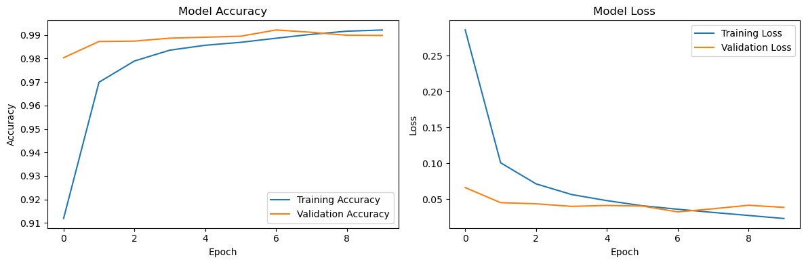

# Import Required Libraries


```python
import tensorflow as tf
from tensorflow.keras.datasets import mnist
from tensorflow.keras.models import Sequential
from tensorflow.keras.layers import Conv2D, MaxPool2D, Flatten, Dense, Dropout
import numpy as np
import matplotlib.pyplot as plt
```

# Load MNIST Dataset


```python
(X_train, y_train), (X_test, y_test) = mnist.load_data()

# Reshape and Normalize Data
X_train = X_train.reshape((X_train.shape[0], 28, 28, 1)) / 255.0
X_test = X_test.reshape((X_test.shape[0], 28, 28, 1)) / 255.0
```

# Define CNN Model Architecture


```python
model = Sequential([
    Conv2D(32, (3, 3), activation='relu', input_shape=(28, 28, 1)),
    MaxPool2D((2, 2)),
    Conv2D(64, (3, 3), activation='relu'),
    MaxPool2D((2, 2)),
    Flatten(),
    Dense(128, activation='relu'),
    Dropout(0.5),
    Dense(10, activation='softmax')
])
```

# Compile Model


```python
model.compile(
    optimizer='adam',
    loss='sparse_categorical_crossentropy',
    metrics=['accuracy']
)
```

# Train Model


```python
history = model.fit(
    X_train, y_train,
    validation_split=0.2,
    epochs=10,
    batch_size=64
)
```
    Epoch 1/10
    [1m750/750[0m [32m━━━━━━━━━━━━━━━━━━━━[0m[37m[0m [1m10s[0m 11ms/step - accuracy: 0.8112 - loss: 0.5913 - val_accuracy: 0.9803 - val_loss: 0.0661
    Epoch 2/10
    [1m750/750[0m [32m━━━━━━━━━━━━━━━━━━━━[0m[37m[0m [1m8s[0m 10ms/step - accuracy: 0.9686 - loss: 0.1057 - val_accuracy: 0.9872 - val_loss: 0.0451
    Epoch 3/10
    [1m750/750[0m [32m━━━━━━━━━━━━━━━━━━━━[0m[37m[0m [1m8s[0m 10ms/step - accuracy: 0.9788 - loss: 0.0729 - val_accuracy: 0.9874 - val_loss: 0.0435
    Epoch 4/10
    [1m750/750[0m [32m━━━━━━━━━━━━━━━━━━━━[0m[37m[0m [1m8s[0m 10ms/step - accuracy: 0.9832 - loss: 0.0563 - val_accuracy: 0.9887 - val_loss: 0.0400
    Epoch 5/10
    [1m750/750[0m [32m━━━━━━━━━━━━━━━━━━━━[0m[37m[0m [1m8s[0m 10ms/step - accuracy: 0.9860 - loss: 0.0454 - val_accuracy: 0.9891 - val_loss: 0.0412
    Epoch 6/10
    [1m750/750[0m [32m━━━━━━━━━━━━━━━━━━━━[0m[37m[0m [1m8s[0m 10ms/step - accuracy: 0.9858 - loss: 0.0447 - val_accuracy: 0.9895 - val_loss: 0.0404
    Epoch 7/10
    [1m750/750[0m [32m━━━━━━━━━━━━━━━━━━━━[0m[37m[0m [1m8s[0m 10ms/step - accuracy: 0.9891 - loss: 0.0346 - val_accuracy: 0.9922 - val_loss: 0.0323
    Epoch 8/10
    [1m750/750[0m [32m━━━━━━━━━━━━━━━━━━━━[0m[37m[0m [1m8s[0m 10ms/step - accuracy: 0.9908 - loss: 0.0325 - val_accuracy: 0.9912 - val_loss: 0.0366
    Epoch 9/10
    [1m750/750[0m [32m━━━━━━━━━━━━━━━━━━━━[0m[37m[0m [1m8s[0m 10ms/step - accuracy: 0.9923 - loss: 0.0246 - val_accuracy: 0.9899 - val_loss: 0.0415
    Epoch 10/10
    [1m750/750[0m [32m━━━━━━━━━━━━━━━━━━━━[0m[37m[0m [1m8s[0m 10ms/step - accuracy: 0.9927 - loss: 0.0213 - val_accuracy: 0.9898 - val_loss: 0.0385
    

# Evaluate Model"


```python
test_loss, test_accuracy = model.evaluate(X_test, y_test)
print(f"Test Accuracy: {test_accuracy*100:.2f}%")
```

    [1m313/313[0m [32m━━━━━━━━━━━━━━━━━━━━[0m[37m[0m [1m1s[0m 3ms/step - accuracy: 0.9876 - loss: 0.0355
    Test Accuracy: 99.10%
    

# Visualization of Training History


```python
plt.figure(figsize=(12,4))
plt.subplot(1,2,1)
plt.plot(history.history['accuracy'], label='Training Accuracy')
plt.plot(history.history['val_accuracy'], label='Validation Accuracy')
plt.title('Model Accuracy')
plt.xlabel('Epoch')
plt.ylabel('Accuracy')
plt.legend()

plt.subplot(1,2,2)
plt.plot(history.history['loss'], label='Training Loss')
plt.plot(history.history['val_loss'], label='Validation Loss')
plt.title('Model Loss')
plt.xlabel('Epoch')
plt.ylabel('Loss')
plt.legend()
plt.tight_layout()
plt.show()
```


    

